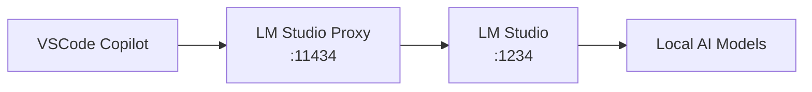

# 🤖 LM Studio Proxy

**Use GitHub Copilot with local LM Studio models via Ollama API compatibility**

[](https://opensource.org/licenses/MIT)
[](https://nodejs.org/)

# LM Studio GitHub Copilot Proxy

A proxy server that enables GitHub Copilot to use local LM Studio models for agent mode with tool calling support.

## Overview

This proxy bridges the gap between VS Code's GitHub Copilot (which expects Ollama API format) and LM Studio (which provides OpenAI API format), enabling you to use local models for:

- ✅ **Tool calling & function calling**
- ✅ **Code completion & generation**
- ✅ **Agent mode in GitHub Copilot**
- ✅ **Streaming responses**
- ✅ **Multiple model support**

## Architecture

```
VS Code GitHub Copilot
    ↓ (Ollama API format)
oai2ollama (port 11434)
    ↓ (format conversion)
LiteLLM (port 4000)
    ↓ (model routing)
LM Studio (port 1234)
    ↓ (model serving)
Your Local Models
```

## Quick Start

1. **Install dependencies:**
   ```bash
   python -m venv venv
   source venv/bin/activate
   pip install -r requirements.txt
   ```

2. **Configure models in LM Studio:**
   - Download your preferred models (see [Recommended Models](#recommended-models))
   - Make sure LM Studio server is running on port 1234

3. **Update model configuration:**
   - Edit `litellm-config.yaml` to match your downloaded models

4. **Start the proxy:**
   ```bash
   ./start-proxy-clean.sh
   ```

5. **Configure VS Code GitHub Copilot:**
   - Set Ollama endpoint to `http://localhost:11434`
   - Use Bearer token: `dummy`

## Recommended Models

For optimal tool calling performance:

- **NousResearch/Hermes-3-Llama-3.1-8B** - Excellent function calling
- **mistralai/Mistral-7B-Instruct-v0.3** - Reliable tool use
- **Qwen/Qwen2.5-7B-Instruct** - Strong reasoning & tools
- **unsloth/gpt-oss-20b-GGUF** - Large context, great performance

## Configuration

### Model Configuration (`litellm-config.yaml`)

Add your models following this pattern:

```yaml
model_list:
  - model_name: your-model-name
    litellm_params:
      model: openai/model-id-in-lmstudio
      api_base: http://localhost:1234/v1
      api_key: dummy
```

### VS Code GitHub Copilot Setup

1. Install the GitHub Copilot extension
2. Configure Ollama integration:
   - Endpoint: `http://localhost:11434`
   - Token: `dummy`

## Files

- `custom_oai2ollama.py` - Core proxy that converts between Ollama and OpenAI API formats
- `litellm-config.yaml` - Model configuration and routing
- `start-proxy-clean.sh` - Main startup script
- `requirements.txt` - Python dependencies

## Troubleshooting

### Common Issues

- **Models not appearing:** Check that model names in config match LM Studio exactly
- **Streaming errors:** The proxy handles chunked encoding - make sure both services are running
- **Tool calling not working:** Ensure you're using models trained for function calling

### Testing the Proxy

```bash
# Test model availability
curl -s http://localhost:11434/api/tags

# Test basic chat
curl -X POST http://localhost:11434/api/chat \
  -H "Content-Type: application/json" \
  -d '{"model": "your-model", "messages": [{"role": "user", "content": "Hello!"}]}'
```

## License

MIT License - see LICENSE file for details.

---

## 🎯 Problem

GitHub Copilot supports Ollama integration, but LM Studio uses the OpenAI API format. This proxy bridges the gap by:

- 🔄 Converting Ollama API calls to OpenAI API format
- 🏠 Enabling local model usage with Copilot
- 🚀 Preserving tool/function calling capabilities
- 📡 No internet required once models are downloaded

## ✨ Solution

**lm-studio-proxy** creates a local translation layer:



## 🚀 Quick Start

### Prerequisites

- [Node.js](https://nodejs.org/) (v18 or higher)
- [LM Studio](https://lmstudio.ai/) installed and running
- VSCode with GitHub Copilot extension

### Installation & Setup

1. **Clone and navigate to the project**
   ```bash
   git clone <your-repo-url>
   cd lmstudio-proxy
   ```

2. **Install dependencies**
   ```bash
   npm install
   ```

3. **Configure environment (optional)**
   ```bash
   cp .env.example .env
   # Edit .env if LM Studio is not on the default port
   ```

4. **Start LM Studio**
   - Open LM Studio
   - Load a model (e.g., Llama 3.2, Codestral, etc.)
   - Start the server (usually runs on `http://localhost:1234`)
   - Ensure the model is loaded and the server is running

5. **Start the proxy**
   ```bash
   npm start
   ```
   You should see:
   ```
   🚀 LM Studio Proxy Server running on http://localhost:11434
   📡 Forwarding requests to LM Studio at: http://localhost:1234
   ```

6. **Configure VSCode**
   - Open VSCode settings (Cmd/Ctrl + ,)
   - Search for "copilot ollama"
   - Set `github.copilot.chat.byok.ollamaEndpoint` to `http://localhost:11434`
   - Click "Manage Models" → Select "Ollama"
   - Your LM Studio models should now appear in the list

7. **Start coding!** 🎉
   Your local LM Studio models are now available in Copilot.

## ⚙️ Configuration

### Environment Variables

Create a `.env` file to customize the proxy:

```env
# Port for the proxy server (default: 11434)
PORT=11434

# LM Studio base URL (default: http://localhost:1234)
LMSTUDIO_BASE_URL=http://localhost:1234

# Log level (error, warn, info, debug)
LOG_LEVEL=info
```

### LM Studio Setup

1. **Download models**: Use LM Studio's model browser to download models
2. **Recommended models for coding**:
   - `microsoft/DialoGPT-medium` - Good for conversations
   - `codellama/CodeLlama-7b-Instruct-hf` - Specialized for code
   - `mistralai/Mistral-7B-Instruct-v0.1` - General purpose
   - `deepseek-ai/deepseek-coder-6.7b-instruct` - Code-focused

3. **Start server**: In LM Studio, go to the server tab and start the local server
4. **Load model**: Select and load your preferred model

## 🔧 How It Works

The proxy performs the following translations:

### API Endpoint Mapping
| Ollama API | LM Studio API | Purpose |
|------------|---------------|---------|
| `GET /api/tags` | `GET /v1/models` | List available models |
| `POST /api/show` | N/A | Model information |
| `POST /api/chat` | `POST /v1/chat/completions` | Chat completions |

### Request/Response Translation

**Ollama Request** → **OpenAI Request**
```javascript
// Ollama format
{
  "model": "llama3.2",
  "messages": [...],
  "stream": true
}

// Converted to OpenAI format
{
  "model": "llama3.2",
  "messages": [...],
  "stream": true,
  "temperature": 0.7,
  "max_tokens": 2048
}
```

**OpenAI Response** → **Ollama Response**
```javascript
// OpenAI format
{
  "choices": [{"message": {"content": "Hello!"}}],
  "usage": {"total_tokens": 10}
}

// Converted to Ollama format
{
  "model": "llama3.2",
  "message": {"role": "assistant", "content": "Hello!"},
  "done": true,
  "total_duration": 1000000
}
```

## 📊 API Endpoints

| Endpoint | Method | Description |
|----------|---------|-------------|
| `/` | GET | Server info and status |
| `/health` | GET | Health check |
| `/api/tags` | GET | List available models |
| `/api/show` | POST | Show model information |
| `/api/chat` | POST | Chat completions (streaming and non-streaming) |

## 🛠️ Development

### Run in development mode
```bash
npm run dev
```

This uses Node.js's `--watch` flag to automatically restart on file changes.

### Testing the proxy

1. **Check if models are available**:
   ```bash
   curl http://localhost:11434/api/tags
   ```

2. **Test chat completion**:
   ```bash
   curl -X POST http://localhost:11434/api/chat \
     -H "Content-Type: application/json" \
     -d '{
       "model": "your-model-name",
       "messages": [{"role": "user", "content": "Hello!"}],
       "stream": false
     }'
   ```

## 🔍 Troubleshooting

### Common Issues

1. **"Failed to fetch models from LM Studio"**
   - Ensure LM Studio is running and the server is started
   - Check if the URL `http://localhost:1234/v1/models` returns data
   - Verify LM Studio is using the default port (1234)

2. **"No models appear in VSCode"**
   - Check that the proxy is running (`http://localhost:11434/api/tags` should return models)
   - Verify VSCode setting `github.copilot.chat.byok.ollamaEndpoint` is correct
   - Restart VSCode after changing settings

3. **"Connection refused"**
   - Check that both LM Studio server and the proxy are running
   - Verify ports are not in use by other applications
   - Check firewall settings if using non-default ports

### Debug Mode

Set `LOG_LEVEL=debug` in your `.env` file for detailed logging:

```env
LOG_LEVEL=debug
```

## 📝 License

This project is licensed under the MIT License - see the [LICENSE](LICENSE) file for details.

## 🙏 Acknowledgments

- [LM Studio](https://lmstudio.ai/) for the excellent local AI platform
- [Ollama](https://ollama.ai/) for the API specification
- The VSCode and GitHub Copilot teams for the integration capabilities

---

<div align="center">

**⭐ Star this repo if it helps you use local models with GitHub Copilot!**

</div>