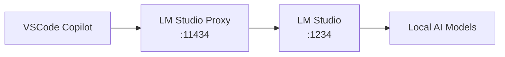

# 🤖 LM Studio Proxy

**Use GitHub Copilot with local LM Studio models via Ollama API compatibility**

[](https://opensource.org/licenses/MIT)
[](https://docker.com/)

# LM Studio GitHub Copilot Proxy

A proxy server that enables GitHub Copilot to use local LM Studio models for agent mode with tool calling support. Now with **Docker support** for easy deployment!

## 🐳 Quick Start with Docker (Recommended)

The easiest way to get started is with Docker:

### 1. Prerequisites
- [Docker](https://docker.com) installed
- [LM Studio](https://lmstudio.ai/) running with a model loaded on port 1234
- [VS Code](https://code.visualstudio.com/) with GitHub Copilot extension

### 2. One-Command Setup
```bash
# Clone the repository
git clone https://github.com/jsirish/lmstudio-copilot-proxy.git
cd lmstudio-copilot-proxy

# Start with Docker Compose (recommended)
docker compose up
```

### 3. Configure VS Code
- Set GitHub Copilot Ollama endpoint to: `http://localhost:11434`
- Use Bearer token: `dummy`
- Click "Manage Models" → Select "Ollama"

That's it! 🎉 Your local LM Studio models are now available in GitHub Copilot.

### Alternative Docker Commands

```bash
# Using docker run
docker run -p 11434:11434 -p 4000:4000 \
  -e LMSTUDIO_URL=http://host.docker.internal:1234 \
  ghcr.io/jsirish/lmstudio-copilot-proxy:latest

# With custom configuration
docker run -p 11434:11434 -p 4000:4000 \
  -v ./config.yaml:/app/config.yaml:ro \
  -e LMSTUDIO_URL=http://host.docker.internal:1234 \
  lmstudio-copilot-proxy:latest
```

---

## Overview

This proxy bridges the gap between VS Code's GitHub Copilot (which expects Ollama API format) and LM Studio (which provides OpenAI API format), enabling you to use local models for:

- ✅ **Tool calling & function calling**
- ✅ **Code completion & generation**
- ✅ **Agent mode in GitHub Copilot**
- ✅ **Streaming responses**
- ✅ **Multiple model support**
- ✅ **Docker deployment**

## Architecture

```
VS Code GitHub Copilot
    ↓ (Ollama API format)
Docker Container:
    ├─ Custom Proxy (port 11434)
    │     ↓ (format conversion)
    └─ LiteLLM (port 4000)
        ↓ (model routing)
Host Machine:
    └─ LM Studio (port 1234)
        ↓ (model serving)
Your Local Models
```

## 🐳 Docker Configuration

### Environment Variables

Create a `.env` file to customize the Docker deployment:

```env
# Core Configuration
LMSTUDIO_URL=http://host.docker.internal:1234
LITELLM_PORT=4000
OLLAMA_PORT=11434
API_KEY=dummy

# Advanced Configuration
LOG_LEVEL=INFO
HEALTH_CHECK_INTERVAL=30
GRACEFUL_SHUTDOWN_TIMEOUT=10
MODEL_REFRESH_INTERVAL=300

# Development Mode (optional)
DEV_MODE=false
HOT_RELOAD=false
DEBUG_LOGGING=false
```

### Volume Mounts

```yaml
volumes:
  # Custom configuration
  - ./config.yaml:/app/config.yaml:ro
  # Log persistence
  - ./logs:/app/logs
  # Cache directory
  - ./.cache:/app/.cache
```

### Health Checks

The container includes built-in health checks:
```bash
# Check if the proxy is healthy
curl http://localhost:11434/api/tags

# Check available models
curl http://localhost:11434/api/tags | jq
```

---

## 🔧 Native Setup (Alternative to Docker)

If you prefer to run without Docker:

1. **Install dependencies:**
   ```bash
   python -m venv venv
   source venv/bin/activate
   pip install -r requirements.txt
   ```

2. **Configure models in LM Studio:**
   - Download your preferred models (see [Recommended Models](#recommended-models))
   - Make sure LM Studio server is running on port 1234

3. **Update model configuration:**
   - Edit `config.yaml` to match your downloaded models

4. **Start the proxy:**
   ```bash
   ./start.sh
   ```

5. **Configure VS Code GitHub Copilot:**
   - Set Ollama endpoint to `http://localhost:11434`
   - Use Bearer token: `dummy`

## Recommended Models

For optimal tool calling performance:

- **NousResearch/Hermes-3-Llama-3.1-8B** - Excellent function calling
- **mistralai/Mistral-7B-Instruct-v0.3** - Reliable tool use
- **Qwen/Qwen2.5-7B-Instruct** - Strong reasoning & tools
- **unsloth/gpt-oss-20b-GGUF** - Large context, great performance

## Configuration

### Model Configuration (`config.yaml`)

Add your models following this pattern:

```yaml
model_list:
  - model_name: your-model-name
    litellm_params:
      model: openai/model-id-in-lmstudio
      api_base: http://localhost:1234/v1
      api_key: dummy
```

### VS Code GitHub Copilot Setup

1. Install the GitHub Copilot extension
2. Configure Ollama integration:
   - Endpoint: `http://localhost:11434`
   - Token: `dummy`

## Files

- `proxy.py` - Core proxy that converts between Ollama and OpenAI API formats
- `config.yaml` - Model configuration 
- `start.sh` - Main startup script
- `requirements.txt` - Python dependencies

## Troubleshooting

### Common Issues

- **Models not appearing:** Check that model names in config match LM Studio exactly
- **Streaming errors:** The proxy handles chunked encoding - make sure both services are running
- **Tool calling not working:** Ensure you're using models trained for function calling

### Testing the Proxy

```bash
# Test model availability
curl -s http://localhost:11434/api/tags

# Test basic chat
curl -X POST http://localhost:11434/api/chat \
  -H "Content-Type: application/json" \
  -d '{"model": "your-model", "messages": [{"role": "user", "content": "Hello!"}]}'
```

## License

MIT License - see LICENSE file for details.

---

## 🎯 Problem

GitHub Copilot supports Ollama integration, but LM Studio uses the OpenAI API format. This proxy bridges the gap by:

- 🔄 Converting Ollama API calls to OpenAI API format
- 🏠 Enabling local model usage with Copilot
- 🚀 Preserving tool/function calling capabilities
- 📡 No internet required once models are downloaded

## ✨ Solution

**lm-studio-proxy** creates a local translation layer:



## 📊 Production Deployment

### Using Docker Hub/GitHub Container Registry

```bash
# Pull and run the latest image
docker run -d \
  --name lmstudio-proxy \
  -p 11434:11434 \
  -p 4000:4000 \
  -e LMSTUDIO_URL=http://host.docker.internal:1234 \
  --restart unless-stopped \
  ghcr.io/jsirish/lmstudio-copilot-proxy:latest

# Or with docker-compose (recommended)
curl -O https://raw.githubusercontent.com/jsirish/lmstudio-copilot-proxy/main/docker-compose.yml
docker compose up -d
```

### Environment-Specific Deployments

#### CI/CD Pipeline
```yaml
# Example GitHub Actions workflow
name: Deploy LM Studio Proxy
on:
  push:
    branches: [main]

jobs:
  deploy:
    runs-on: ubuntu-latest
    steps:
      - uses: actions/checkout@v3
      - name: Deploy to production
        run: |
          docker compose -f docker-compose.prod.yml up -d
```

#### Docker Swarm
```bash
# Deploy as a service
docker service create \
  --name lmstudio-proxy \
  --publish 11434:11434 \
  --env LMSTUDIO_URL=http://host.docker.internal:1234 \
  --replicas 2 \
  ghcr.io/jsirish/lmstudio-copilot-proxy:latest
```

#### Kubernetes
```yaml
# k8s deployment example
apiVersion: apps/v1
kind: Deployment
metadata:
  name: lmstudio-proxy
spec:
  replicas: 1
  selector:
    matchLabels:
      app: lmstudio-proxy
  template:
    metadata:
      labels:
        app: lmstudio-proxy
    spec:
      containers:
      - name: proxy
        image: ghcr.io/jsirish/lmstudio-copilot-proxy:latest
        ports:
        - containerPort: 11434
        env:
        - name: LMSTUDIO_URL
          value: "http://host.minikube.internal:1234"
```

---

## 🚀 Quick Start (Alternative Native Setup)

If you prefer to run without Docker:

### Prerequisites

- [Node.js](https://nodejs.org/) (v18 or higher)
- [LM Studio](https://lmstudio.ai/) installed and running
- VSCode with GitHub Copilot extension

### Installation & Setup

1. **Clone and navigate to the project**
   ```bash
   git clone https://github.com/jsirish/lmstudio-copilot-proxy.git
   cd lmstudio-copilot-proxy
   ```

2. **Install dependencies**
   ```bash
   python -m venv venv
   source venv/bin/activate
   pip install -r requirements.txt
   ```

3. **Configure environment (optional)**
   ```bash
   cp .env.example .env
   # Edit .env if LM Studio is not on the default port
   ```

4. **Start LM Studio**
   - Open LM Studio
   - Load a model (see [Recommended Models](#recommended-models))
   - Start the server (runs on `http://localhost:1234`)
   - Ensure the model is loaded and the server is running

5. **Start the proxy**
   ```bash
   ./start.sh
   ```

6. **Configure VS Code**
   - Open VS Code settings (Cmd/Ctrl + ,)
   - Search for "copilot ollama"
   - Set `github.copilot.chat.byok.ollamaEndpoint` to `http://localhost:11434`
   - Click "Manage Models" → Select "Ollama"
   - Your LM Studio models should now appear in the list

7. **Start coding!** 🎉

## ⚙️ Configuration

### Environment Variables

Create a `.env` file to customize the proxy:

```env
# Port for the proxy server (default: 11434)
PORT=11434

# LM Studio base URL (default: http://localhost:1234)
LMSTUDIO_BASE_URL=http://localhost:1234

# Log level (error, warn, info, debug)
LOG_LEVEL=info
```

### LM Studio Setup

1. **Download models**: Use LM Studio's model browser to download models
2. **Recommended models for coding**:
   - `microsoft/DialoGPT-medium` - Good for conversations
   - `codellama/CodeLlama-7b-Instruct-hf` - Specialized for code
   - `mistralai/Mistral-7B-Instruct-v0.1` - General purpose
   - `deepseek-ai/deepseek-coder-6.7b-instruct` - Code-focused

3. **Start server**: In LM Studio, go to the server tab and start the local server
4. **Load model**: Select and load your preferred model

## 🔧 How It Works

The proxy performs the following translations:

### API Endpoint Mapping
| Ollama API | LM Studio API | Purpose |
|------------|---------------|---------|
| `GET /api/tags` | `GET /v1/models` | List available models |
| `POST /api/show` | N/A | Model information |
| `POST /api/chat` | `POST /v1/chat/completions` | Chat completions |

### Request/Response Translation

**Ollama Request** → **OpenAI Request**
```javascript
// Ollama format
{
  "model": "llama3.2",
  "messages": [...],
  "stream": true
}

// Converted to OpenAI format
{
  "model": "llama3.2",
  "messages": [...],
  "stream": true,
  "temperature": 0.7,
  "max_tokens": 2048
}
```

**OpenAI Response** → **Ollama Response**
```javascript
// OpenAI format
{
  "choices": [{"message": {"content": "Hello!"}}],
  "usage": {"total_tokens": 10}
}

// Converted to Ollama format
{
  "model": "llama3.2",
  "message": {"role": "assistant", "content": "Hello!"},
  "done": true,
  "total_duration": 1000000
}
```

## 📊 API Endpoints

| Endpoint | Method | Description |
|----------|---------|-------------|
| `/` | GET | Server info and status |
| `/health` | GET | Health check |
| `/api/tags` | GET | List available models |
| `/api/show` | POST | Show model information |
| `/api/chat` | POST | Chat completions (streaming and non-streaming) |

## 🛠️ Development

### Run in development mode
```bash
npm run dev
```

This uses Node.js's `--watch` flag to automatically restart on file changes.

### Testing the proxy

1. **Check if models are available**:
   ```bash
   curl http://localhost:11434/api/tags
   ```

2. **Test chat completion**:
   ```bash
   curl -X POST http://localhost:11434/api/chat \
     -H "Content-Type: application/json" \
     -d '{
       "model": "your-model-name",
       "messages": [{"role": "user", "content": "Hello!"}],
       "stream": false
     }'
   ```

## 🔍 Troubleshooting

### Docker-Specific Issues

1. **"Container can't connect to LM Studio"**
   - Use `host.docker.internal:1234` instead of `localhost:1234` in LMSTUDIO_URL
   - On Linux, you may need to use `--network host` or the host's IP address
   - Ensure LM Studio is binding to `0.0.0.0:1234`, not just `127.0.0.1:1234`

2. **"Models not showing up in VS Code"**
   - Check container health: `docker compose logs`
   - Verify endpoints are accessible:
     ```bash
     curl http://localhost:11434/api/tags
     curl http://localhost:4000/v1/models
     ```
   - Make sure ports 11434 and 4000 aren't in use by other services

3. **"Build fails with SSL errors"**
   - Build with `--network=host` if behind corporate firewall
   - Or use pre-built image: `ghcr.io/jsirish/lmstudio-copilot-proxy:latest`

4. **"Container exits immediately"**
   - Check logs: `docker compose logs lmstudio-proxy`
   - Ensure LM Studio is running and accessible before starting container
   - Verify configuration in `.env` file or docker-compose.yml

### Platform-Specific Notes

#### macOS
```bash
# Use the default configuration
LMSTUDIO_URL=http://host.docker.internal:1234
```

#### Linux
```bash
# Option 1: Use host networking (easiest)
docker run --network host lmstudio-copilot-proxy:latest

# Option 2: Use host IP (replace with your IP)
LMSTUDIO_URL=http://192.168.1.100:1234
```

#### Windows
```bash
# Use the default configuration
LMSTUDIO_URL=http://host.docker.internal:1234
```

### Common Issues (General)

1. **"Failed to fetch models from LM Studio"**
   - Ensure LM Studio is running and the server is started
   - Check if the URL returns data: `curl http://localhost:1234/v1/models`
   - Verify LM Studio is using the default port (1234)

2. **"No models appear in VSCode"**
   - Check that the proxy is running: `curl http://localhost:11434/api/tags`
   - Verify VSCode setting `github.copilot.chat.byok.ollamaEndpoint` is correct
   - Restart VSCode after changing settings

3. **"Connection refused"**
   - Check that both LM Studio server and the proxy are running
   - Verify ports are not in use by other applications
   - Check firewall settings if using non-default ports

### Debug Mode

#### Docker Debug
```bash
# Enable debug logging
docker compose up -e DEBUG_LOGGING=true

# Or with docker run
docker run -e LOG_LEVEL=DEBUG lmstudio-copilot-proxy:latest
```

#### Native Debug
Set `LOG_LEVEL=debug` in your `.env` file:

```env
LOG_LEVEL=debug
```

## 🛠️ Development

### Docker Development

#### Build locally
```bash
# Build the image
docker build -t lmstudio-copilot-proxy:local .

# Run with development settings
docker compose -f docker-compose.yml up
```

#### Development with hot-reload
```bash
# Enable development mode
docker compose up -e DEV_MODE=true -e HOT_RELOAD=true
```

#### Multi-platform builds
```bash
# Build for multiple architectures
docker buildx build --platform linux/amd64,linux/arm64 -t lmstudio-copilot-proxy:latest .
```

## 🛠️ Development

### Docker Development

#### Build locally
```bash
# Build the image
docker build -t lmstudio-copilot-proxy:local .

# Run with development settings
docker compose up
```

#### Development with hot-reload
```bash
# Enable development mode
docker compose up -e DEV_MODE=true -e HOT_RELOAD=true
```

#### Multi-platform builds
```bash
# Build for multiple architectures
docker buildx build --platform linux/amd64,linux/arm64 -t lmstudio-copilot-proxy:latest .
```

### Testing the Proxy

1. **Check if models are available**:
   ```bash
   curl http://localhost:11434/api/tags
   ```

2. **Test chat completion**:

## 📝 License

This project is licensed under the MIT License - see the [LICENSE](LICENSE) file for details.

## 🙏 Acknowledgments

- [LM Studio](https://lmstudio.ai/) for the excellent local AI platform
- [Ollama](https://ollama.ai/) for the API specification
- The VSCode and GitHub Copilot teams for the integration capabilities

---

<div align="center">

**⭐ Star this repo if it helps you use local models with GitHub Copilot!**

</div>